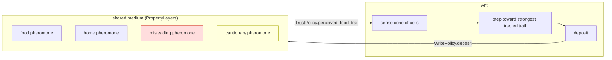
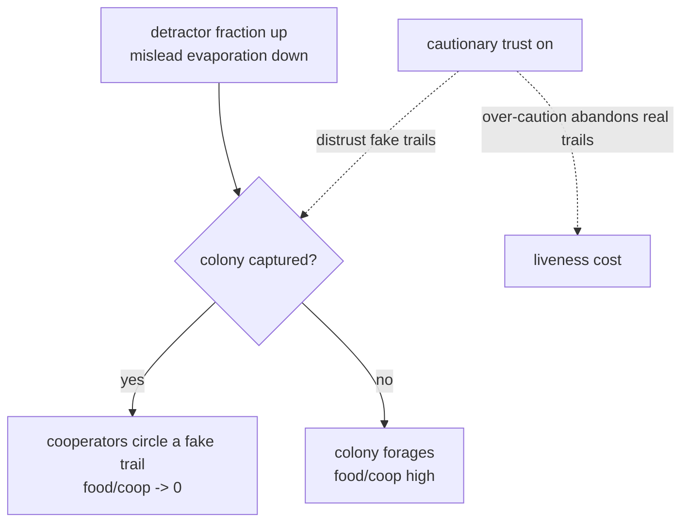
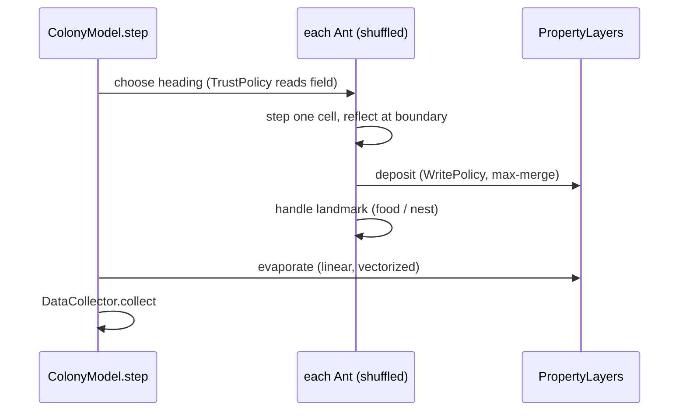

# Architecture

## The protocol layer

The design move that makes this a bench, not a reimplementation: stigmergy is factored into swappable read/write policies, so the medium, the attack, and the defense are independent knobs.

- **Read side** (`TrustPolicy`): `NaiveTrust` perceives `food + mislead` as one channel (the indistinguishability that is the whole attack surface). `CautionaryTrust` zeroes any cell where `caution > food`.
- **Write side** (`WritePolicy`): `HonestWrite` lays home pheromone while searching and food pheromone while returning. `DetractorWrite` lays misleading pheromone into the food channel. `_deposit_cautionary` lays the defense signal, growing as patience falls.

## Capture vs liveness

The sweep (`src/sweep.py`) walks the (detractor fraction, misleading-pheromone evaporation) plane and reports food delivered per cooperator. The boundary between "forages" and "trapped" is the paper's Figure 4 and the bench's headline output.

## Step cycle

Evaporation and deposition are numpy operations on `PropertyLayer.data`, not per-agent loops, which is what keeps the model interactive at a few hundred ants.

## Connections to the wider program

This is a concrete instance of an authentication-free coordination protocol with a formal attack/defense surface, which is the territory of the Formal Protocol Theory work. The cautionary pheromone is a reference signal correcting a homeostat (the Conant-Ashby / governance-lens framing): a second-order control layer that detects when the medium has been corrupted and adjusts how agents trust it. A follow-up note will develop that framing for the SIG.
