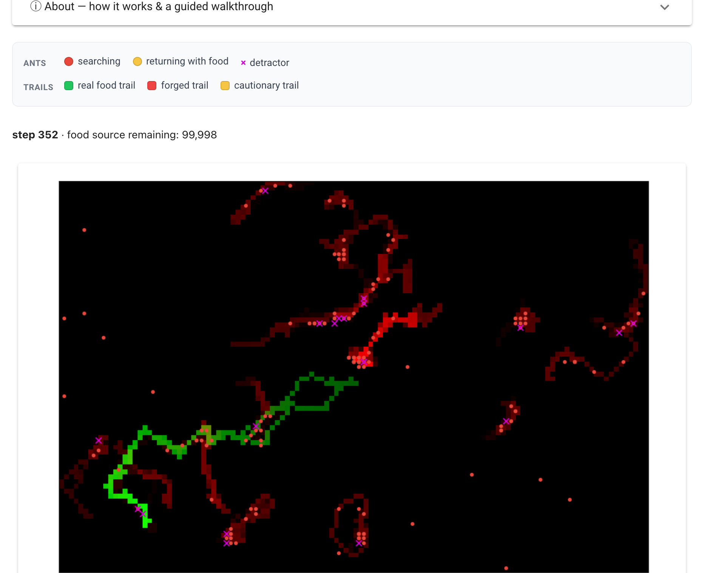

# Stigmergy Protocol Bench

[](https://stigmergy-bench-production.up.railway.app)

A small, tunable agent-based model of **stigmergy as a coordination protocol**, and what happens to it under adversarial agents. It reimplements and generalizes Aswale, López, Ammartayakun, and Pinciroli, *"Hacking the Colony: On the Disruptive Effect of Misleading Pheromone and How to Defend Against It"* (AAMAS 2022, [arXiv:2202.01808](https://arxiv.org/abs/2202.01808)).

**▶ [Try it live in your browser](https://stigmergy-bench-production.up.railway.app)** — no install. Drive the colony, crank up the detractors until foraging collapses, then toggle the cautionary defense and watch it partly recover.

[](https://stigmergy-bench-production.up.railway.app)

## Why this exists

Stigmergy is environment-mediated coordination: agents write signals into a shared medium (pheromone) and read them back, with no direct messaging and no central authority. The trail *is* the protocol. The paper's result is that this protocol has a sharp adversarial cliff. A small minority of "detractors" depositing **indistinguishable** misleading pheromone gets honest agents to reinforce each other's fake trails, and foraging collapses. The defense, a second-order "cautionary" signal, buys safety at the cost of liveness.

That is a protocol-theory result dressed as an ant model: an authentication-free shared-medium protocol, a Sybil-style minority capturing collective behavior, and a costly trust layer that trades liveness for safety. This bench makes the protocol the object of study rather than the ants.

## The bench idea

The protocol is factored out of the agents into two swappable strategy interfaces (`src/protocol.py`):

- **`WritePolicy`** — what an agent deposits. `HonestWrite` (food/home pheromone) vs `DetractorWrite` (forged food pheromone).
- **`TrustPolicy`** — how an agent reads the medium. `NaiveTrust` (follow the strongest signal, can't tell honest from forged) vs `CautionaryTrust` (distrust cells others have flagged as fruitless).

The paper's three regimes are three policy assignments:

| regime | cooperators | adversaries |
|---|---|---|
| honest colony | `(HonestWrite, NaiveTrust)` | — |
| under attack | `(HonestWrite, NaiveTrust)` | `(DetractorWrite, NaiveTrust)` |
| with defense | `(HonestWrite, CautionaryTrust)` | `(DetractorWrite, NaiveTrust)` |

The bench is the experiment harness over these assignments plus the parameters. It measures **capture vs liveness**: is the colony still foraging, or has the adversary trapped it?

## Scale note

The paper simulates a 1920×1080 world (a 480×270 pheromone grid), 1024 ants, 50000 steps. That is faithful but heavy for an interactive Python model. This bench keeps the load-bearing ratios (food-to-nest distance, sensing range, deposit/evaporation constants, the indistinguishable food+mislead channels) and exposes world size and ant count as parameters that default to a fast interactive scale. The goal is to reproduce the **Figure 4 boundary** (a few percent detractors plus slow-evaporating forgery collapses foraging), not pixel-exact dynamics. Dial the parameters up in `src/constants.py` toward paper fidelity if you want.

## Quickstart

```bash
python3 -m venv venv && source venv/bin/activate
pip install -r requirements.txt

pytest tests/                      # mechanism invariants

python -m src.sweep --quick        # small capture-vs-liveness sweep -> output/sweep.csv
python analysis.py                 # heatmap.png + field.png in images/

solara run app.py                  # interactive dashboard
```

## What you'll see

- **`images/field.png`** — the pheromone field over time: a clean green food trail consolidating between nest and food, while detractors weave a red misleading-pheromone web (paper Figs 1/3).
- **`images/heatmap.png`** — food delivered per cooperator across detractor fraction × misleading-pheromone evaporation. The red/blue boundary is the adversarial cliff (paper Fig 4).
- **[live demo](https://stigmergy-bench-production.up.railway.app)** (or `solara run app.py` locally) — drive it live: raise the detractor fraction or slow the misleading-pheromone evaporation and watch foraging collapse, then toggle the cautionary defense and watch it partly recover. The dashboard's **About** panel carries the full legend and a guided walkthrough.

For the protocol-theory framing (the "why this matters past ants" argument), see [`docs/one-pager.md`](docs/one-pager.md).

## Layout

```
src/
  constants.py   ColonyParams (paper Table 1, rescaled)
  protocol.py    WritePolicy + TrustPolicy strategy objects  <- the bench
  agents.py      Ant: sense a cone -> step toward strongest trusted trail -> deposit
  model.py       ColonyModel: 4 pheromone PropertyLayers, vectorized evap/deposit
  metrics.py     capture-vs-liveness reporters
  sweep.py       batch_run -> Fig-4 heatmap
analysis.py      render heatmap + field snapshots (no Solara needed)
app.py           interactive dashboard (built directly on Solara)
tests/           mechanism invariants
```

The headless path (`sweep.py` + `analysis.py`) reproduces the paper's result with matplotlib alone. The Solara dashboard is an enhancement on top, not a dependency of the result.

## Origins & credits

The model comes from Aswale et al., *"Hacking the Colony"* (AAMAS 2022, [arXiv:2202.01808](https://arxiv.org/abs/2202.01808)); their parameter table (rescaled) and two attack/defense mechanisms are the specification this bench implements. The paper's experiments ran on the [NESTLab/AntSimulator](https://github.com/NESTLab/AntSimulator) C++ fork of [johnBuffer/AntSimulator](https://github.com/johnBuffer/AntSimulator). This repository is an **independent, from-scratch reimplementation in Python** ([Mesa 3](https://github.com/projectmesa/mesa)), not a port of that code, refactored so that the coordination protocol itself is the swappable object of study.

Built as part of [Halcyonic Systems](https://github.com/halcyonic-systems) work on formal protocol theory and the common core of systems science.

## License

MIT. See [`LICENSE`](LICENSE).
